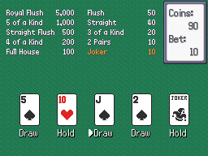
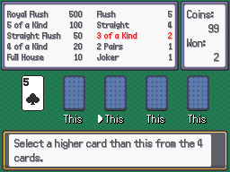

# Video Poker
This plugin is for Pokémon Essentials. It's a Video Poker minigame, specifically the Jokers Wild used in Dragon Quest. It uses coins like a Game Corner game.

## Screens

## Installation
Follow FL's [Essentials plugin installation instructions](https://github.com/FL-/Misc/tree/main/Guides/EssentialsInstallPlugin). For Essentials version 18.1 or lower, put the script above main. You can find more resources in [Extra Resurces folder](/Extra%20Resources).

## How to Use
Look at [Script](/Content/Plugins/Video%20Poker/001_Video%20Poker.rb) for instructions.

## Download
